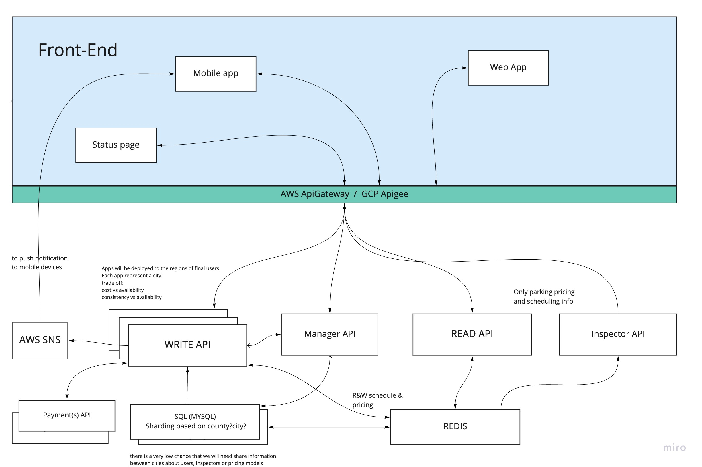

# City Parking 

WIP  - it's still Work in progress 

This is just a concept of backend for the city parking application.
The idea was to create an app with using native Golang packages and less external packages

## System Design
Miro Board https://miro.com/app/board/uXjVOZWLF4I=/?invite_link_id=106276965135

This repo is all about the Backend of the application.

The design should be cloud-agnostic in an ideal world, but we are all humans and can make mistakes. My first mistake is to design this with AWS :)

I want to host the Backend at AWS. it will be a set of lambda functions with AWS API Gateway in front of this.
### Benefits:
- Scaling independently. We don't want to scale up Administrators API endpoints with the main Users API.
- Geo distribution
- API Gateway works as a load balancer and manages user's authentication.
- Our service needs to be available, and we are ok if the data won't be fresh.
  Example: Inspector API checks if the parking spot is paid or not. It will be paid at least for an hour if it's paid. This information can be changed later (another person paid/extended the parking spot booking), but this hour is already paid anyway. we need this information available for an inspector; then we can refresh it with newly updated hours
- Separation of payment methods to a separate lambda function helps with scalability and performance. If the payment system is down, we don't want to slow down or main application. Let's implement a circuit breaker
### Database:
- NoSQL DB would work well for this project at this stage, but if we want to add user stats and manage roles, relation DB would be a better option.
- Database scheme and relation is well-represented in `entity` folder

 
## LOCAL
The app do not require yet any DB connection 

### run on local: 
- If you are using GoLand or IntelliJ, you can just start the app from the `main.go`

- Running terminal command  `go run main.go` would also make it work
### test on local:
see `HTTPrequest` folder for examples of requests

### Potential problems
if something wrong, run `go mod tidy` It adds any missing module requirements necessary to build the current module’s packages and dependencies, and it removes requirements on modules that don’t provide any relevant packages