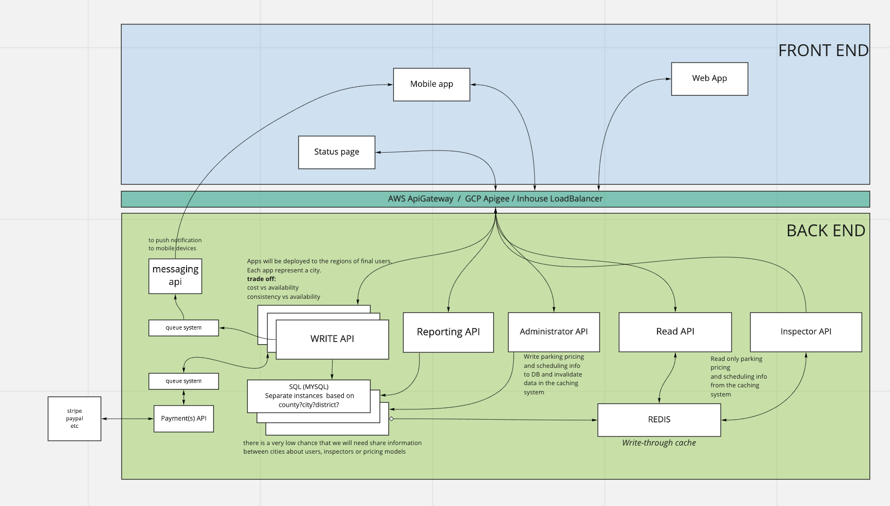
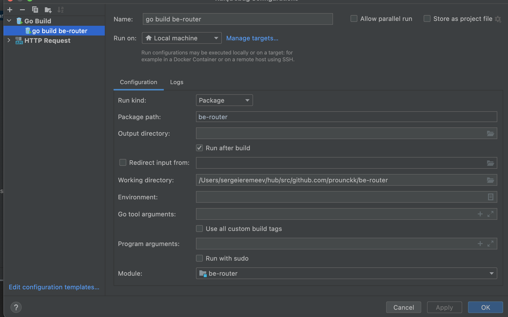
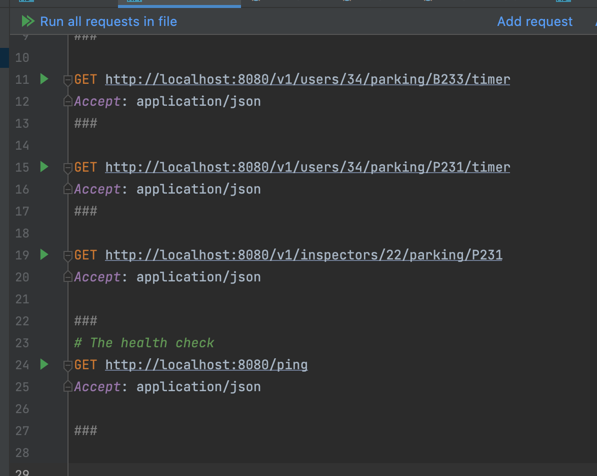

# City Parking 

WIP  - it's still Work in progress 

This is just a concept of backend for the city parking application.
The idea was to create an app with using native Golang packages and less external packages

## System Design
Miro Board https://miro.com/app/board/uXjVOZWLF4I=/?invite_link_id=106276965135

The design is cloud-agnostic, but I'm using here examples of AWS services, just to increase clarity.

I see it as a set of lambda functions with the AWS API Gateway in front of this.
### Benefits:
- Scaling independently. We don't want to scale up Administrators API endpoints with the main Users API.
- Geo distribution
- API Gateway works as a load balancer and manages user's authentication.
- Our service needs to be available, and we are ok if the data won't be fresh across all geo distributes services.
  Example: Inspector API checks if the parking spot is paid or not. It will be paid at least for an hour if it's paid. This information can be changed later (another person paid/extended the parking spot booking), but this hour is already paid anyway. We need this information available for an inspector; then we can refresh it with newly updated hours
- Payment controller is a separate lambda function to help with scalability and performance. If the payment system is down, we don't want to slow down the main application. Save requests in the queue and try up to 3 times before failing. 
### Database:
- NoSQL DB would work well for this project at this stage, but to manage user and parking stats, relation DB would be a better option. Plus the DBs are separated based on geo
- Database scheme and relation is well-represented in `entity` folder

 
## LOCAL TESTING
The app do not require yet any DB connection for now, but will be added soon

### run on local: 
- If you are using GoLand or IntelliJ, you can just start the app from the `main.go`

- Running terminal command  `go run main.go` would also make it work
### test on local:
see `HTTPrequest` folder for examples of requests

### Potential problems
if something wrong, run `go mod tidy` It adds any missing module requirements necessary to build the current module’s packages and dependencies, and it removes requirements on modules that don’t provide any relevant packages