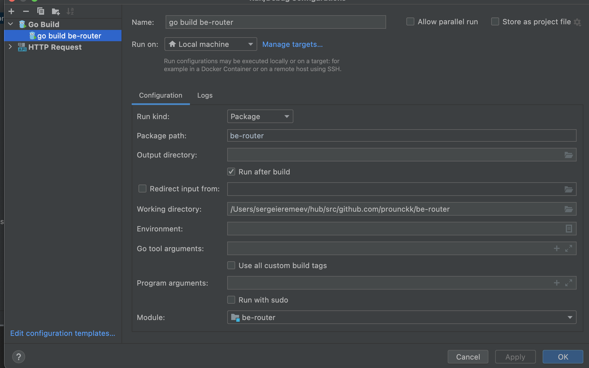
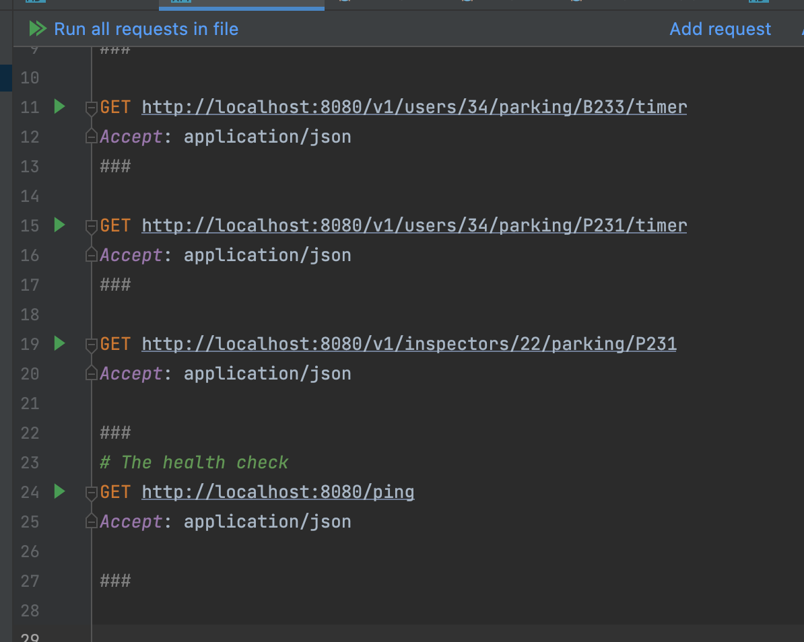

# City Parking 

WIP  - it's still Work in progress 

This is just a concept of backend for the city parking application.
The idea was to create an app with using native Golang packages and less external packages

## LOCAL
The app do not require yet any DB connection 

### run on local: 
- If you are using GoLand or IntelliJ, you can just start the app from the `main.go`

- Running terminal command  `go run main.go` would also make it work
### test on local:
see `HTTPrequest` folder for examples of requests

### Potential problems
if something wrong, run `go mod tidy` It adds any missing module requirements necessary to build the current module’s packages and dependencies, and it removes requirements on modules that don’t provide any relevant packages